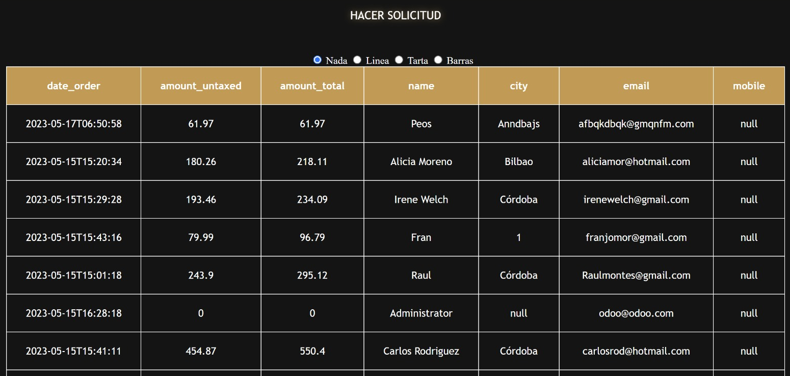
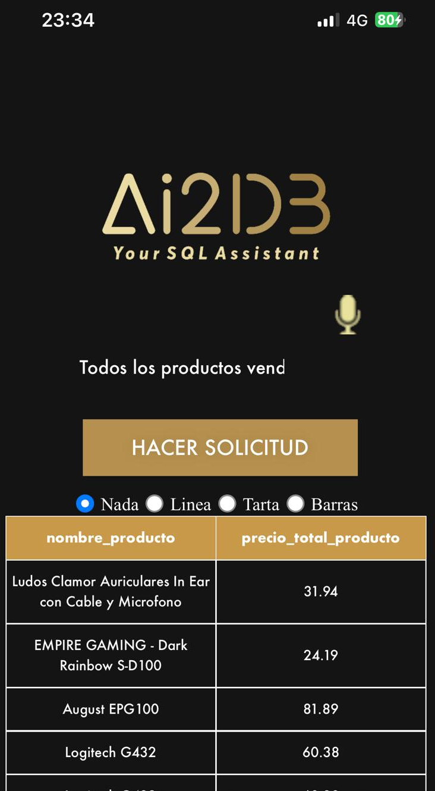
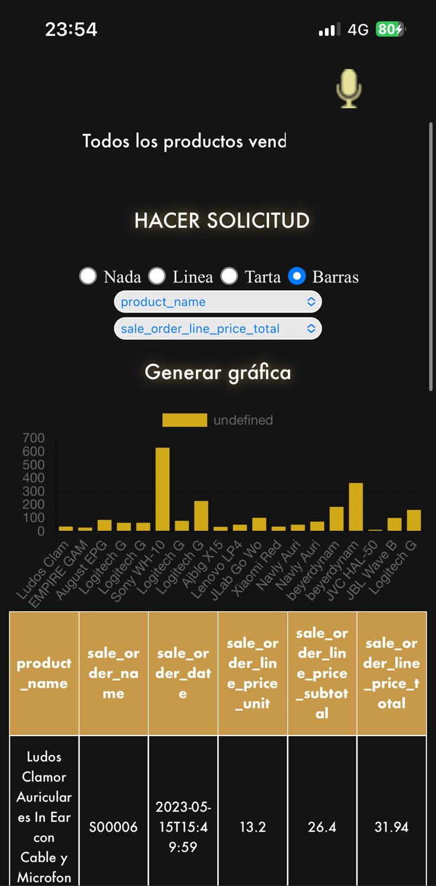

# AI2DB

This open-source project is aimed at helping, both database managers and executives, to make it easier to understand and evaluate insights from a database.

## Project Overview

The server allows en executive or economist, with no technical knowledge, to explore a database. 

In order to do so, the executive just would have to write what he would like to know about the database. For example, he could
write "Show me all 

## Screenshots

### Desktop version

### Mobile version

## Getting Started

This section will guide you on how to install and use this service in your own project.

### Prerequisites

You will need a server with python, docker and docker-compose installed on it.

### Installation

Copy the project in a folder and run 'docker-compose up'. Just by doing this, you should be provided with the port on wich the service is running, in your localhost. 

## Contributing

Contributions to this project are welcomed. If you have a feature request or find a bug, please open an issue. If you wish to contribute code, please open a pull request.

## License

